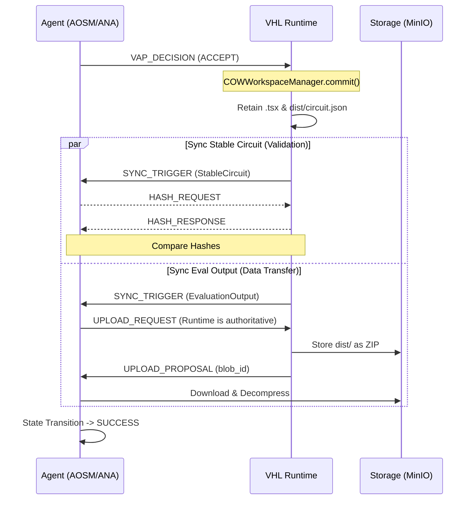

# Architecture Analysis: Stable Circuit Synchronization & System Extensibility

## 1. Executive Summary
The VHL synchronization architecture has been evolved from a purely agent-driven model to an integrated, event-driven system. By moving the synchronization trigger for the **StableCircuit** and the newly introduced **EvaluationOutput** resource to the VAP (Virtual Assessment Platform) decision phase, the system ensures atomicity between the runtime's local file commitment and the agent's view of the project state.

## 2. Analysis of the Implementation

### 2.1 The Selective COW Commit
The `COWWorkspaceManager.commit()` function was refactored from a generic recursive "copy-all" strategy to a **Selective Retention Strategy**.
- **Mechanism**: After an evaluation, the runtime identifies specific "Critical Files" (`${circuitName}.tsx` and `dist/circuit.json`) in the ephemeral COW (Copy-On-Write) directory.
- **Benefit**: This prevents "pollution" of the main workspace with temporary build artifacts, log files, or intermediate code generated during the assessment process. It enforces a strict boundary for what constitutes a "Stable" version.

### 2.2 Event-Driven Post-Decision Sync
Previously, the Agent Backend (specifically the AOSM) was responsible for both proposing the evaluation and then triggering a sync to "pull" results. This created a potential race condition where the agent might request sync before the runtime had finalized its local file commitment.
- **New Pattern**: The runtime now **owns the trigger** following a VAP `ACCEPT`.
- **Flow**:
  1. Agent sends `VAP_DECISION: ACCEPT`.
  2. Runtime performs `COWWorkspaceManager.commit()`.
  3. Runtime immediately emits `SYNC_TRIGGER` for `StableCircuit` and `EvaluationOutput`.
  4. Agent waits for `SYNC_COMPLETE`.

### 2.3 Authoritative Resource Roles
The system now clearly distinguishes between two types of resources:
- **Agent-Authoritative**: (e.g., `Circuit`, `StableCircuit`). The backend generates the code; the runtime validates and applies it.
- **Runtime-Authoritative**: (e.g., `Library`, `EvaluationOutput`). The runtime generates artifacts (like `circuit.json` or evaluation logs); the agent pulls them for its internal reasoning.

## 3. Architecture Extensibility

The current architecture provides a highly extensible blueprint for adding new features or data types to the VHL ecosystem.

### 3.1 Adding a New Resource Type
To add a new resource (e.g., `LayoutOutput` or `SimulationTrace`), the developer only needs to follow these three steps:

| Step | Location | Detail |
| :--- | :--- | :--- |
| **1. Define** | `syncTypes.ts` & `models.py` | Add the new string to the `ResourceType` enum. |
| **2. Route** | `SyncManager.ts` & `manager.py` | Implementation of `getResourcePath()` to define where the files live on both ends. |
| **3. Authorize** | `SyncManager.isLocalAuthoritative()` | Define which side "owns" the data to prevent accidental overwrites during conflict resolution. |

### 3.2 Protocol Versatility (`Dynamic Context`)
We introduced the `data` field in the `SyncPayload`. This is a critical extensibility point:
- **Use Case**: When syncing a circuit, the system needs to know *which* circuit name to use to find the `.tsx` file.
- **Implementation**: The runtime passes `{ "circuit_name": "MyCircuit" }` in the sync hit.
- **Future Use**: This can be used for versioning (`version_id`), branch names, or metadata filters for simulation outputs.

### 3.3 Evaluation Environment Scaling
Because the `COWWorkspaceManager` is decoupled from the `SyncManager`, we can:
- Swap out the local `cp -al` (hardlinks) for a Docker-based volume mount or an S3-backed ephemeral workspace without changing a single line of synchronization logic.
- Inject different "Provisional" files based on the task type, allowing the same architecture to handle Schematic evaluation, DRC checks, and Layout verification.

## 4. Conceptual Diagram: Post-VAP Sync Flow

## 5. Conclusion
The current architecture is **highly decoupled** and **bi-directionally authoritative**. By leveraging the sync protocol for state validation (StableCircuit) and data transfer (EvaluationOutput) simultaneously, we have created a robust framework. Adding new features now requires minimal boilerplate, primarily focusing on path resolution and ownership definition.
