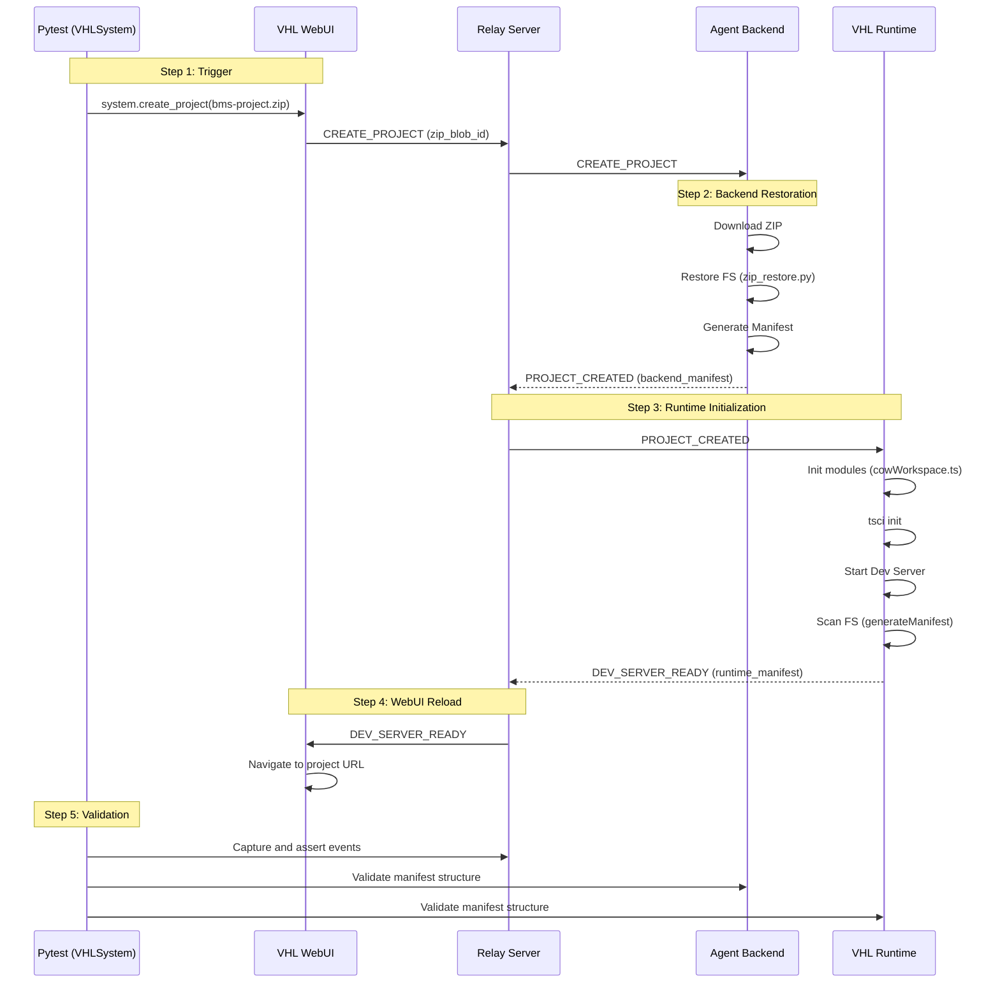

# VHL System E2E Test Documentation: Project Creation Workflow

This document provides a comprehensive overview of the End-to-End (E2E) testing implementation for the Virtual Hardware Laboratory (VHL) System, specifically focusing on the **Project Creation** workflow.

## Overview

The Project Creation E2E test validates the full lifecycle of project initialization, from the user's action in the WebUI to the successful setup of the development environment in the VHL Runtime. The test ensures that:
1.  ZIP-based project uploads are correctly handled by the backend.
2.  Hierarchical project structures are accurately restored from manifests.
3.  The VHL Runtime correctly mirrors the project structure and initializes the `tscircuit` development environment.
4.  The WebUI successfully reacts to system events and navigates to the active project.

## Workflow Architecture

The following diagram illustrates the interaction between system components during the project creation flow:



## Involved Components and Files

### 1. Test Orchestration (`tests/`)
- [test_create_project.py](VHL-System/tests/e2e/test_create_project.py): The main test entry point.
- [conftest.py](VHL-System/tests/fixtures/conftest.py): Contains the `managed_services` fixture (lifecycle automation) and the `VHLSystem` class (state validation).
- [env.json](VHL-System/tests/config/env.json): Environment configuration (URLs).

### 2. Agent Backend (`vhl-agent-backend/`)
- [manager.py](VHL-System/vhl-agent-backend/workspace/manager.py): Handles the `CREATE_PROJECT` event and workspace creation.
- [zip_restore.py](VHL-System/vhl-agent-backend/workspace/zip_restore.py): Logic for reconstructing the project from a flattened ZIP based on a manifest.

### 3. VHL Runtime (`vhl-runtime/`)
- [vhlRuntime.ts](VHL-System/vhl-runtime/src/workspace/vhlRuntime.ts): Orchestrates project initialization and status broadcasting.
- [cowWorkspace.ts](VHL-System/vhl-runtime/src/utils/cowWorkspace.ts): Handles directory creation and `tsci` initialization.
- [vhlWebUI.ts](VHL-System/vhl-runtime/src/workspace/vhlWebUI.ts): Manages the `tscircuit` dev server and generates the runtime manifest.

## Automated Environment Management

The E2E test suite automatically manages the lifecycle of all required services via the `managed_services` fixture. You do **not** need to manually start Docker or the backend before running the tests.

### Lifecycle Steps:
1.  **Cleanup**: Terminates any existing `aosm` processes and stops `vhl-runtime` containers.
2.  **Runtime Startup**: Starts `vhl-runtime` via `docker compose up -d`.
3.  **Workspace Isolation**: Creates a unique temporary directory for the test session.
4.  **Backend Startup**: Starts `vhl-agent-backend` on the host using `uv run aosm <temp_dir>`.
5.  **Health Verification**: Waits for all ports (1080, 3020) to be open and for the backend to connect to the relay.
6.  **Teardown**: Gracefully shuts down all services and deletes the temporary workspace after tests complete.

## Detailed Execution Instructions

### 1. Environment Setup
Ensure `uv` and Playwright are installed:
```bash
uv pip install pytest playwright websocket-client
uv run playwright install chromium
```

### 2. Test Resources
- A valid project directory must exist under `tests/resources/e2e/vhl-agent-backend/bms-project`.
- An expected manifest for comparison must be present at `tests/resources/e2e/vhl-agent-backend/bms-project_manifest.json`.

> [!IMPORTANT]
> **Generating Test Resources**:
> Modern VHL backends use a Git-style manifest format. If resources are missing or outdated, regenerate them with:
> ```bash
> cd tests/resources/e2e/vhl-agent-backend/
> uv run python3 ../../../scripts/generate_manifest.py bms-project --format git -z
> ```
> This will create `bms-project_manifest.json` (git format) and `bms-project.zip`.

### 3. Running the Test
Execute the test using `pytest`:
```bash
uv run pytest tests/e2e/test_create_project.py -s
```

### 4. Monitoring and Debugging
- **Real-time Logs**: The `-s` flag allows you to see live logs. Backend logs are automatically streamed to the console with the `[Backend]` prefix.
- **Screenshots**: If a test fails, a `debug_screenshot.png` is captured in the root directory.
- **Event Logs**: `[VHL Event]` logs show the sequence of messages received by the observer for easier tracing.

## Technical Assumptions
- **Playwright Hooks**: The WebUI must expose the `createProject` hook on `window.__VHL_TEST_HOOKS__`.
- **Relay Broadcasts**: The test assumes the Relay Server broadcasts all system events to connected observers.
- **Docker Access**: The user running the tests must have permissions to execute `docker compose`.