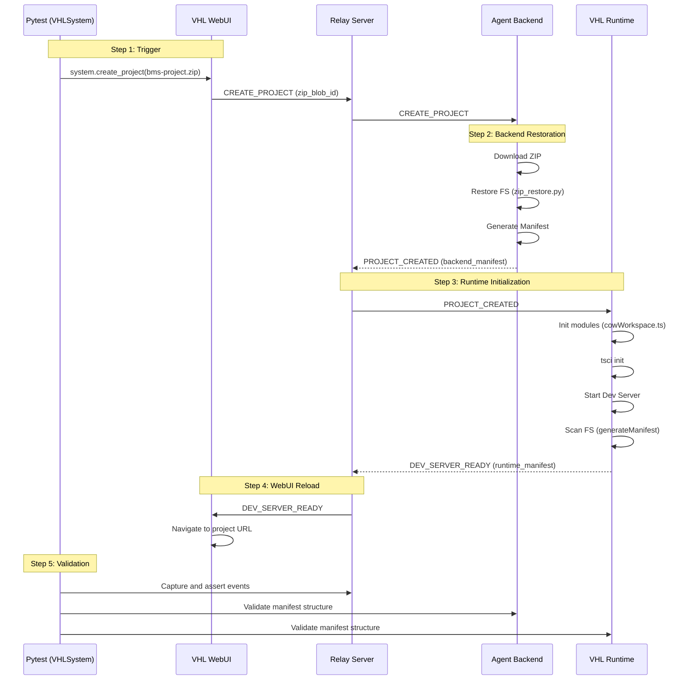

# VHL System E2E Test Documentation: Project Creation Workflow

This document provides a comprehensive overview of the End-to-End (E2E) testing implementation for the Virtual Hardware Laboratory (VHL) System, specifically focusing on the **Project Creation** workflow.

## Overview

The Project Creation E2E test validates the full lifecycle of project initialization, from the user's action in the WebUI to the successful setup of the development environment in the VHL Runtime. The test ensures that:
1.  ZIP-based project uploads are correctly handled by the backend.
2.  Hierarchical project structures are accurately restored from manifests.
3.  The VHL Runtime correctly mirrors the project structure and initializes the `tscircuit` development environment.
4.  The WebUI successfully reacts to system events and navigates to the active project.

## Workflow Architecture

The following diagram illustrates the interaction between system components during the project creation flow:



## Involved Components and Files

### 1. Test Orchestration (`tests/`)
- [test_create_project.py](VHL-System/tests/e2e/test_create_project.py): The main test entry point.
- [conftest.py](VHL-System/tests/fixtures/conftest.py): Contains the `VHLSystem` class, which manages Playwright, WebSockets, and state validation.
- [env.json](VHL-System/tests/config/env.json): Environment configuration (URLs).

### 2. Agent Backend (`vhl-agent-backend/`)
- [manager.py](VHL-System/vhl-agent-backend/workspace/manager.py): Handles the `CREATE_PROJECT` event and workspace creation.
- [zip_restore.py](VHL-System/vhl-agent-backend/workspace/zip_restore.py): Logic for reconstructing the project from a flattened ZIP based on a manifest.

### 3. VHL Runtime (`vhl-runtime/`)
- [vhlRuntime.ts](VHL-System/vhl-runtime/src/workspace/vhlRuntime.ts): Orchestrates project initialization and status broadcasting.
- [cowWorkspace.ts](VHL-System/vhl-runtime/src/utils/cowWorkspace.ts): Handles directory creation and `tsci` initialization.
- [vhlWebUI.ts](VHL-System/vhl-runtime/src/workspace/vhlWebUI.ts): Manages the `tscircuit` dev server and generates the runtime manifest.

## Preconditions and Assumptions

### System State
- The **Relay Server** must be running (default: port 1080).
- The **Agent Backend** must be running (default: port 8000).
- The **VHL Runtime** must be running (default: port 3000).
- The **VHL WebUI** must be accessible (default: port 3020).

### Test Resources
- A valid project directory must exist under `tests/resources/e2e/vhl-agent-backend/bms-project`.
- An expected manifest for comparison must be present at `tests/resources/e2e/vhl-agent-backend/bms-project_manifest.json`.
- A compressed project archive `bms-project.zip` must exist.

> [!IMPORTANT]
> **Generating Test Resources**:
> If the `bms-project.zip` or manifest is missing, use the generation script:
> ```bash
> cd tests/resources/e2e/vhl-agent-backend/
> python3 ../../../scripts/generate_manifest.py bms-project -z
> ```
> This will create both `bms-project.json` and `bms-project.zip`.

## Detailed Execution Instructions

### 1. Environment Setup
Ensure all dependencies are installed for the test environment:
```bash
pip install pytest playwright websocket-client
playwright install chromium
```

### 2. Configuration
Verify the URLs in `tests/config/env.json` match your local running services:
```json
{
    "VHL_RUNTIME_URL": "http://localhost:3000",
    "VHL_AGENT_BACKEND_URL": "http://localhost:8000",
    "VHL_WEBUI_URL": "http://localhost:3020",
    "VHL_RELAY_URL": "ws://localhost:1080"
}
```

### 3. Running the Test
Execute the test using `pytest`:
```bash
pytest tests/e2e/test_create_project.py -s
```
The `-s` flag is recommended to see the real-time logs from the `VHLSystem` observer.

### 4. Debugging
- If a test fails, a `debug_screenshot.png` is automatically captured in the current directory.
- Check the console output for `[VHL Event]` logs, which show the sequence of messages received by the observer.
- Manifest mismatches will print both the `Expected` and `Actual` structures to stdout.

## Assumptions
- **Playwright Hooks**: The WebUI must expose the `createProject` hook on `window.__VHL_TEST_HOOKS__`.
- **WebSocket Visibility**: The test assumes the Relay Server broadcasts all system events to connected observers.
- **Tsci Availability**: The VHL Runtime environment must have `tsci` installed and available in the `PATH`.
